# 🐍 Cowrie SSH Honeypot for Intrusion Monitoring

---

## 🔎 1. Introduction

### 🛡️ What is a Honeypot?

A honeypot is a decoy system designed to appear vulnerable and attract cyber attackers. Its purpose is to monitor, detect, and analyze malicious activity without risking actual production systems.

---

### 🌐 Why Are Honeypots Useful in Cybersecurity?

Honeypots:
- Collect real-world data on attacker behavior
- Identify new exploits or malware
- Improve intrusion detection systems
- Provide intelligence without affecting real assets

They act as early-warning systems and research tools in threat intelligence and cybersecurity defense.

### 🐍 Why Cowrie?

Cowrie is a popular low-interaction honeypot focused on SSH and Telnet services. It allows:
- Full session logging of attacker commands
- File upload/download emulation
- Fake file systems and user accounts
- JSON and text log outputs for SIEM integration

Cowrie was chosen due to its rich logging features, ease of deployment, and compatibility with monitoring tools like Splunk and Wazuh.

---

## 🎯 2. Project Objectives

-  **Simulate an exposed SSH service** Host a fake SSH server to lure attackers.

-  **Attract unauthorized access attempts** Deploy Cowrie in a visible IP range or test lab to receive intrusion attempts.

-  **Collect attacker commands and artifacts** Log all session activity, including entered commands, attempted downloads, and scanned ports.

-  **Analyze threat behavior** Study collected logs to understand attacker patterns, tools, and techniques.

-  **Optionally forward logs to SIEM** Integrate with platforms like Splunk or Wazuh for real-time alerting and visualization.

---

## 🧰 3. Tools and Technologies Used

This project utilized a combination of open-source tools and technologies to simulate an SSH honeypot, collect attacker data, and enable log analysis. Each tool served a distinct role in the architecture.

---

### 🐍 i. Cowrie

- **Type**: SSH/Telnet Honeypot (Low-Interaction)
- **Purpose**: Simulates an SSH service to capture attacker commands, session behavior, and file downloads
- **Source**: [https://github.com/cowrie/cowrie](https://github.com/cowrie/cowrie)

### 🖥️ ii. Kali Linux

- **Type**: Host Operating System
- **Purpose**: Base platform for deploying Cowrie
- **Version**: Latest stable version at time of deployment (2025)
- **Reason for Use**: Comes with pre-installed tools and Python support. Easy to manage network interfaces and routing for honeypot labs

### 🐍 iii. Python 3 & Virtualenv

- **Python Version**: 3.9+
- **Virtual Environment Tool**: `venv`
- **Purpose**: Create an isolated environment for Cowrie and its dependencies. Avoid conflicts with system-wide Python packages

### 🔐 iv. ParrotOs

- **Type**: Attacker's System
- **Purpose**: Simulate real world attacks

### 📊 v. Splunk (Optional)

- **Type**: Security Information and Event Management (SIEM)
- **Purpose**: Centralized log collection and visualization
- **Integration**: Cowrie logs were forwarded using the HTTP Event Collector (HEC), Dashboards and alerts were created to analyze real-time attacker data

### 🧪 vi. Other Utilities

| Tool       | Purpose                                    |
|------------|--------------------------------------------|
| `jq`       | JSON parsing and log formatting            |
| `tail`     | Real-time log monitoring                   |
| `nano`     | Editing Cowrie config files (`cowrie.cfg`) |
| `wget`/`curl` | Simulated file downloads by attackers  |

These tools together formed a complete honeypot lab environment that was lightweight, modular, and effective for capturing attacker telemetry.

---

## ⚙️ 4. Execution Strategy

The Cowrie honeypot was deployed on a Kali Linux virtual machine to emulate a vulnerable SSH environment. The following strategic decisions and configurations were made during execution:

---

### 🔐 i. Ports and Services Exposed

- **Primary exposed service**: SSH (simulated by Cowrie)
- **Port used**: Port `2222` was chosen instead of the default port `22` to avoid the need for `authbind` or elevated privileges. This also helps avoid conflicts with any real SSH service running on the host.

- **Telnet service**: Disabled, Focus was kept on SSH to reduce noise and maintain a focused attack surface.

### 🌍 ii. Network Exposure

- **Deployment mode**: Internal/controlled lab environment
- **Internet exposure**:  *Not publicly exposed* The honeypot was **not made accessible from the public internet** for safety and control. Instead, simulated attacks were performed from an internal Kali Linux VM acting as an attacker.
- **Visibility**: The honeypot was placed on a local virtual network shared between attacker and defender VMs (using VirtualBox Host-Only or Internal Adapter). This allowed for controlled testing of brute-force login attempts, command execution, and logging.

---

## 🎭 5. Deception Tactics Employed

Cowrie is a low-interaction honeypot designed to simulate a real Linux system and mislead attackers into believing they have successfully gained shell access. The following deception techniques were used during this project:

---

### ✅ i. Fake File System

- **Description**: Cowrie emulates a complete Linux file system structure.
- **Purpose**: Allows attackers to navigate directories, run commands like `ls`, `cd`, `cat`, etc., and believe they are interacting with a real machine.
- **Location**: Defined in the `share/cowrie/fs.pickle` file and extended by symbolic links.

### ✅ ii. Fake User Credentials

- **Description**: A predefined list of usernames and passwords is stored in `etc/userdb.txt`.
- **Purpose**: Allows attackers to "successfully" authenticate and gain shell access, increasing interaction time.
- **Example**: `root:password123` could be configured to always succeed.

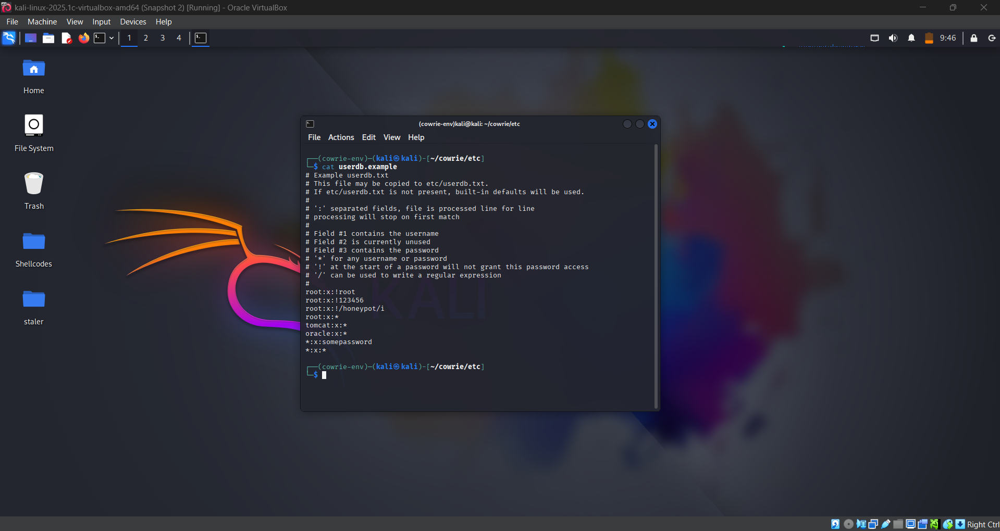


### ✅ iii. Command Emulation

- **Description**: Cowrie simulates output for commonly used Linux commands (e.g., `ls`, `uname`, `cat`, `top`, `ps`).
- **Purpose**: Keeps attackers engaged by mimicking a functional shell environment.
- **Logged**: All commands and their fake outputs are logged in `cowrie.log` and `cowrie.json`.

### ✅ iv. Session Logging (TTY & JSON)

- **Description**: Full session logging, including keystrokes and terminal outputs.
- **Purpose**: Enables forensic analysis and replay of attacker activity.
- **Storage**:
  - Text logs: `var/log/cowrie/cowrie.log`
  - JSON logs: `var/log/cowrie/cowrie.json`
  - TTY logs: `var/log/cowrie/tty/`

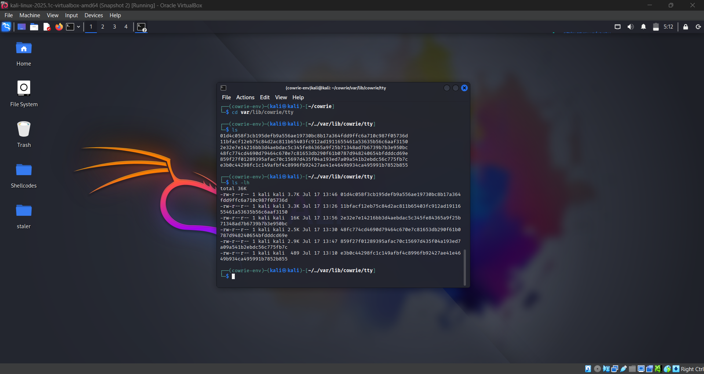


### ✅ v. File Download Interception

- **Description**: Commands like `wget` and `curl` are intercepted.
- **Purpose**: Captures any files an attacker attempts to download for later analysis.
- **Storage Location**: `dl/` directory inside the Cowrie root.

### ✅ vi. Shell Prompt Emulation

- **Description**: Presents a fake shell prompt to attackers.
- **Purpose**: Makes attackers believe they have real access.
- **Behavior**: Responds to standard shell interactions and command structures.

### ✅ vii. Fake Network Configuration

- **Description**: Emulated outputs for `ifconfig`, `ip a`, and other network-related commands.
- **Purpose**: Prevents attackers from discovering it's a honeypot by hiding the real network state.

These tactics make Cowrie highly effective for capturing attacker behavior while ensuring the host system remains safe and isolated.

---

## 🛠️ 6. Attack Observations

After deploying the Cowrie honeypot on Kali Linux (SSH port: 2222), several attacker-like behaviors were simulated internally to evaluate the honeypot’s effectiveness and logging capabilities.

---

### 🚨 Types of Attacks Simulated

| Attack Type           | Description                                                                 |
|------------------------|-----------------------------------------------------------------------------|
| **Brute Force (Hydra)** | Attempted multiple logins using a dictionary file to trigger Cowrie's fake authentication mechanism |
| **Command Execution**   | Ran common shell commands like `ls`, `cd /`, and `cat /etc/passwd`         |
| **File Upload**         | Uploaded a test script named `malware.sh` using `scp`                      |
| **Network Scanning**    | Used `nmap` to scan the honeypot's IP and services                         |
| **Successful SSH Login**| Logged in as a fake user with a configured password to trigger full session capture |

---

###🧨 Attack Descriptions

Below is a detailed description of each attack type simulated during the project and how Cowrie handled or logged it.

---

#### 🔑 1. SSH Login Attempt (Manual)

- **Description**: A legitimate-looking SSH login was made using one of the valid credentials stored in Cowrie’s `userdb.txt` file.
- **Purpose**: To verify Cowrie’s ability to simulate a real SSH shell and to observe command logging.
- **Command Example**:
  ```bash
  ssh root@192.168.56.102 -p 2222
  ```
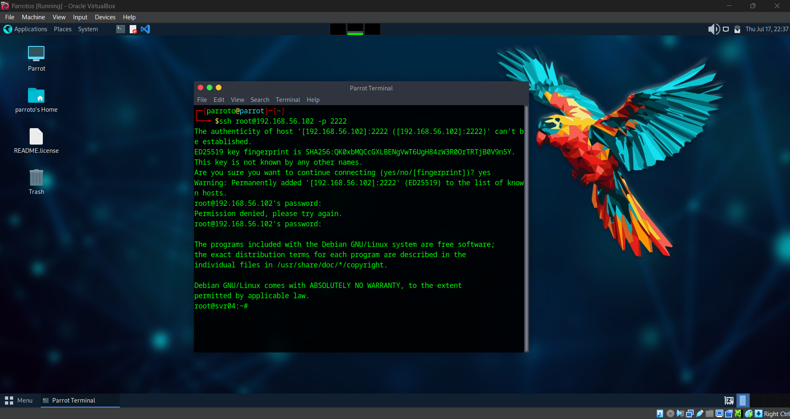

---

#### 🧪 2. Brute Force Attack using Hydra

- **Tool Used**: `Hydra`
- **Purpose**: Simulate dictionary-based brute-force attacks commonly seen in the wild.
- **Command Example**:
  ```bash
  hydra -l root -P rockyou.txt ssh://192.168.56.102 -s 2222
  ```

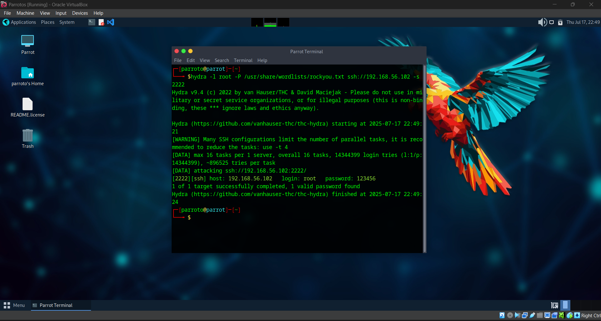
  
---

#### 📦 3. File Upload via SCP (malware.sh)

- **Tool Used**: scp
- **Action**: Uploaded a test script (malware.sh) to Cowrie’s fake file system. Simulated post-upload actions like chmod +x and ./malware.sh
- **Command Example**:
 ```bash
 scp -P 2222 malware.sh root@192.168.56.102:/tmp/
 ```

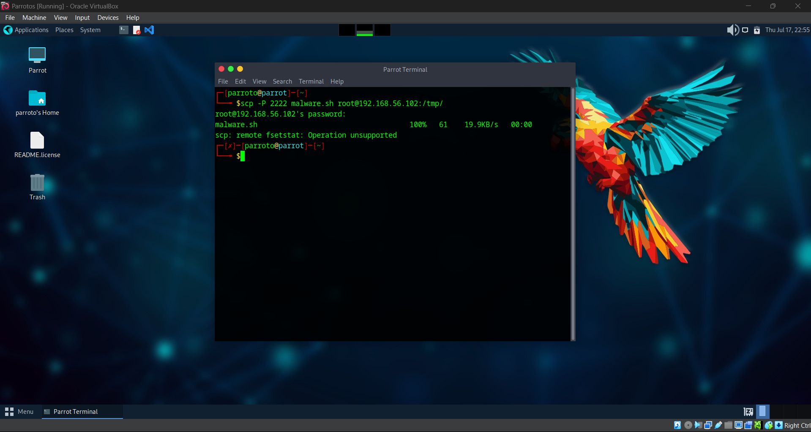

---

#### 📂 4. Post-auth Command Execution

- **Purpose**: To simulate how a real attacker might explore a compromised machine.
- **Commands Used**: ls, cd /, cat /etc/passwd, whoami, uname -a

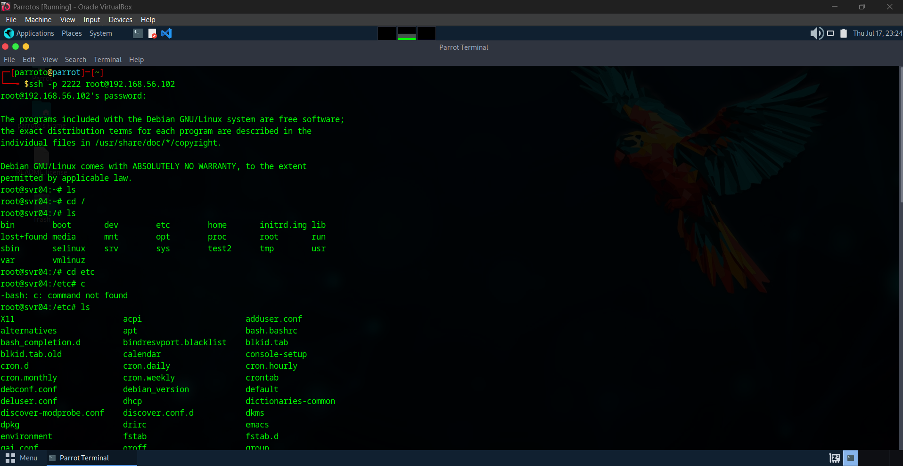

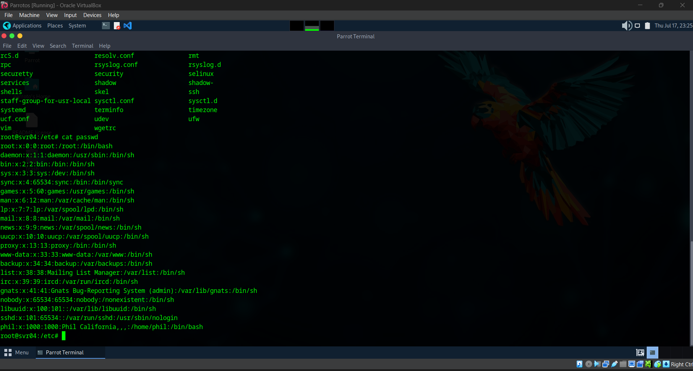

---

#### 🔍 5. Network Scanning via Nmap

- **Tool Used**: nmap
- **Purpose**: To simulate an attacker trying to enumerate services on the honeypot host.
- **Command Example**:
```bash
nmap -sV -A 192.168.56.102
```

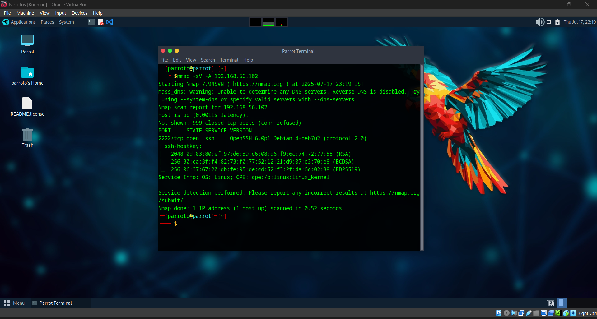

---

## 📈 7. Log Analysis & Alerting

Each simulated attack was analyzed using Cowrie’s logs, which include plaintext logs (`cowrie.log`), structured JSON logs (`cowrie.json`), and TTY session files (`tty/`). Below is a detailed breakdown of how each attack was logged and interpreted.

---

### 🧪 1. Brute Force Attack using Hydra

- **Log Files**: `var/log/cowrie/cowrie.log` `var/log/cowrie/cowrie.json`

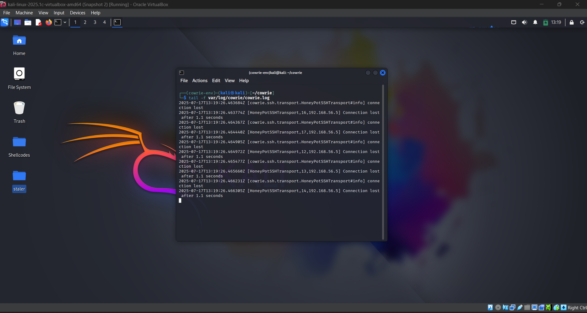

Demonstrates brute-force bot behavior or scanning attempts.
Cowrie records brute-force password attempts:
Multiple cowrie.login.failed events with guesses like nicole, 123456, rockyou, lovely.
One cowrie.login.success using root:123456.
Useful for creating blocklists and detecting password dictionary trends.

**cowrie.json logs**

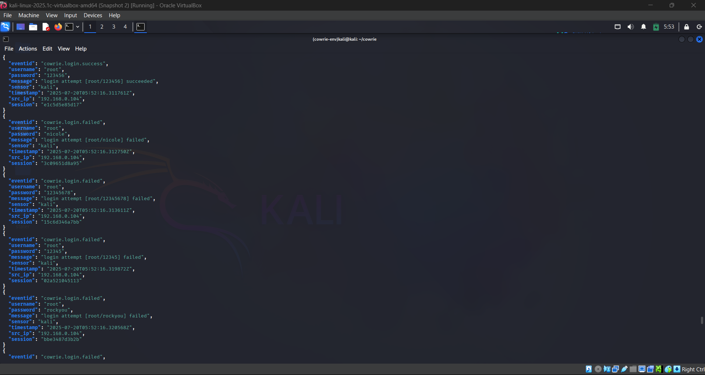

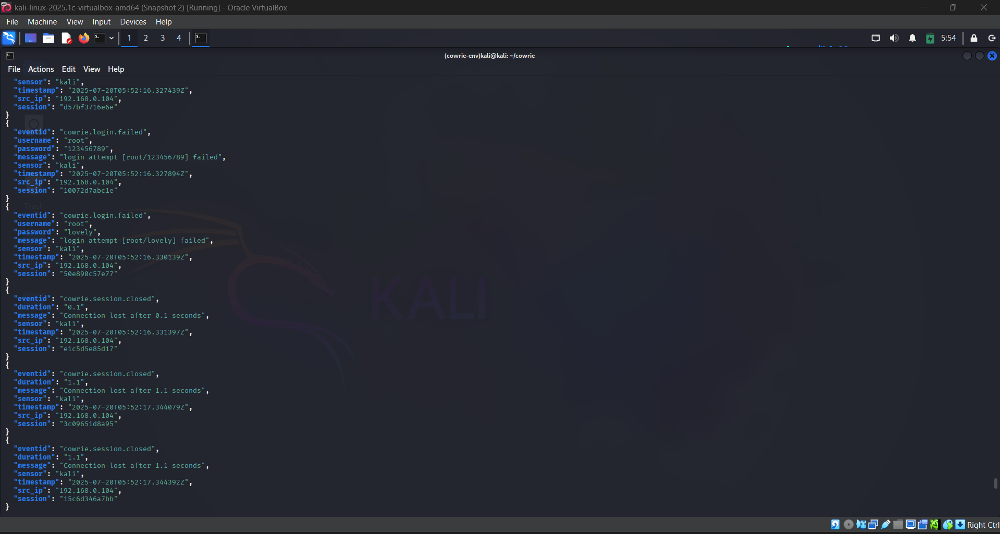

---

### 🔑 2. Manual SSH Login

- **Log Files**: `cowrie.log` `cowrie.json`

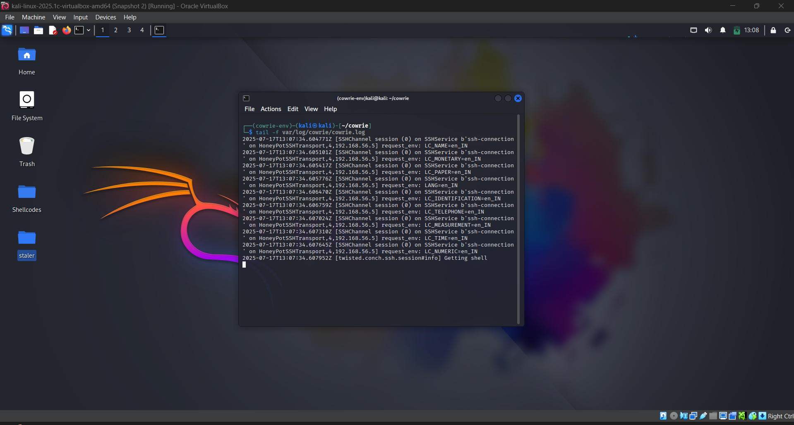

This shows:
Full connection metadata (src_ip, dst_ip, session, port) under cowrie.session.connect.
SSH version used by attacker (OpenSSH_9.2p1) helps identify toolset.
cowrie.client.kex reveals SSH algorithms used, showing what the attacker’s SSH client supports.

**cowrie.json logs**

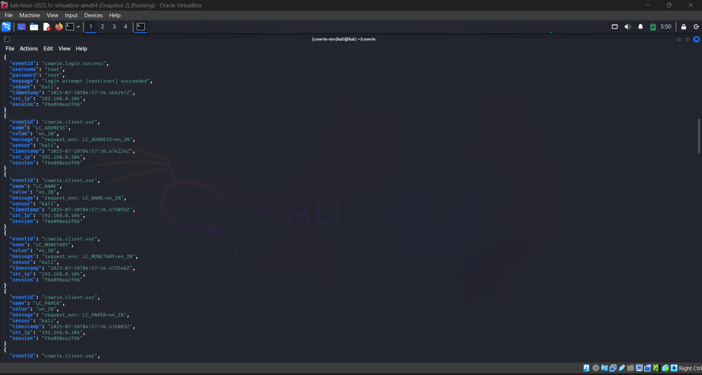

---

### 📂 3. Post-Authentication Command Execution

- **Log Files**: `cowrie.log` `tty/ directory (session replay)`

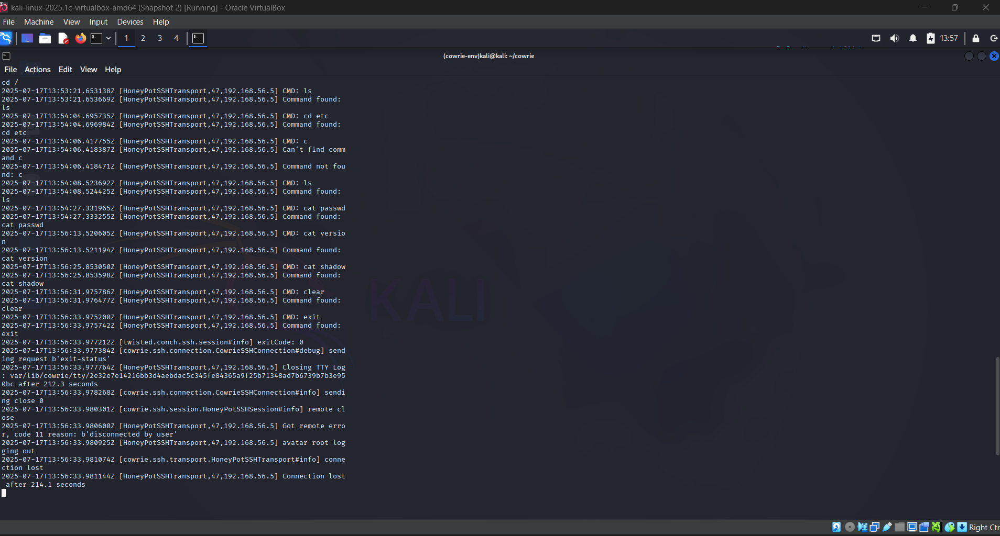

This provides insight into attacker intent — looking for user credentials, clearing screen, possibly preparing for further action.

**tty/ playlog**

[▶️ Watch tty session demo](Screenshots/tty_playlog.mp4)

---

### 📦 4. File Upload via SCP (malware.sh)

- **Log Files**: `cowrie.json` `Uploaded files saved in dl/`

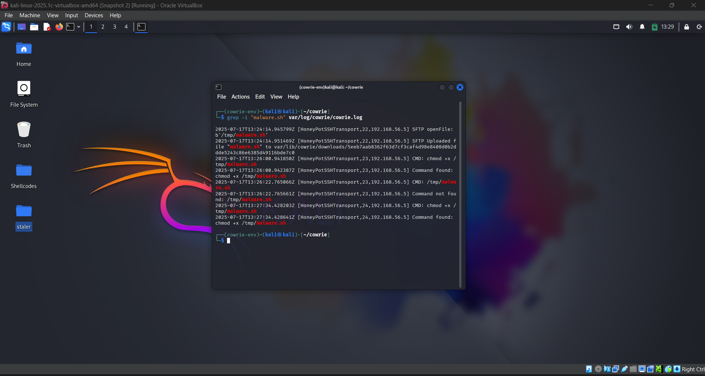

JSON logs show:
Attacker's environment variables (LC_TELEPHONE, LC_MEASUREMENT, etc.) reveal system locale and can hint at origin.
cowrie.session.file_upload event shows a file uploaded with hash and destination.
Helpful for malware analysis and attribution.

**cowrie.json**

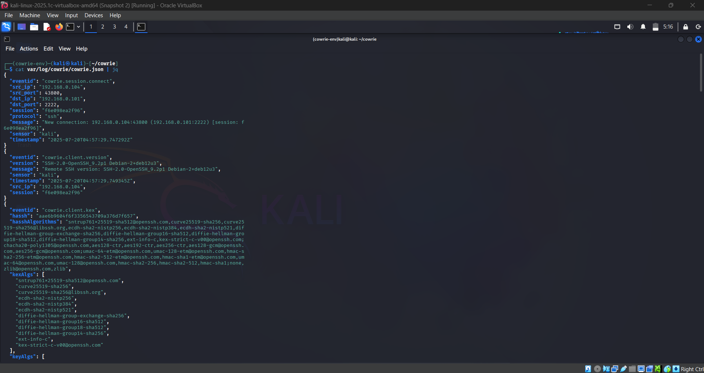

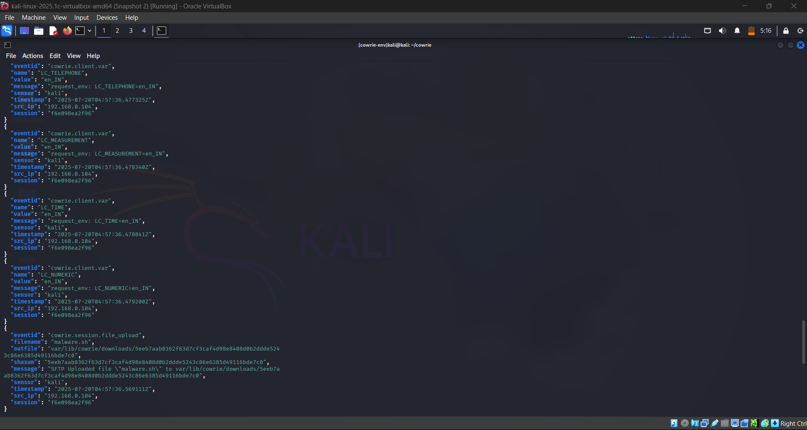

**Uploaded file saved in downloads**

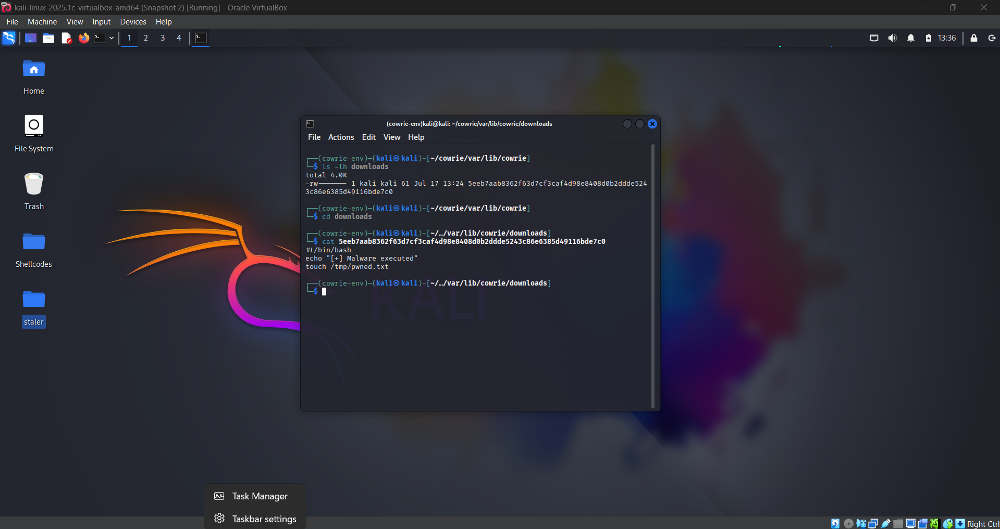

---

### 🔍 5. Network Scanning via Nmap

- **Log Files**: `var/log/cowrie/cowrie.log`

This log (tail -f var/log/cowrie/cowrie.log) shows repeated SSH connection attempts from IP 192.168.56.5. Each connection:
Is accepted on port 2222 (Cowrie default).
Fails at key exchange or SSH fingerprint verification.
Ends with a connection lost message (within ~0.1 to 1.1 seconds).

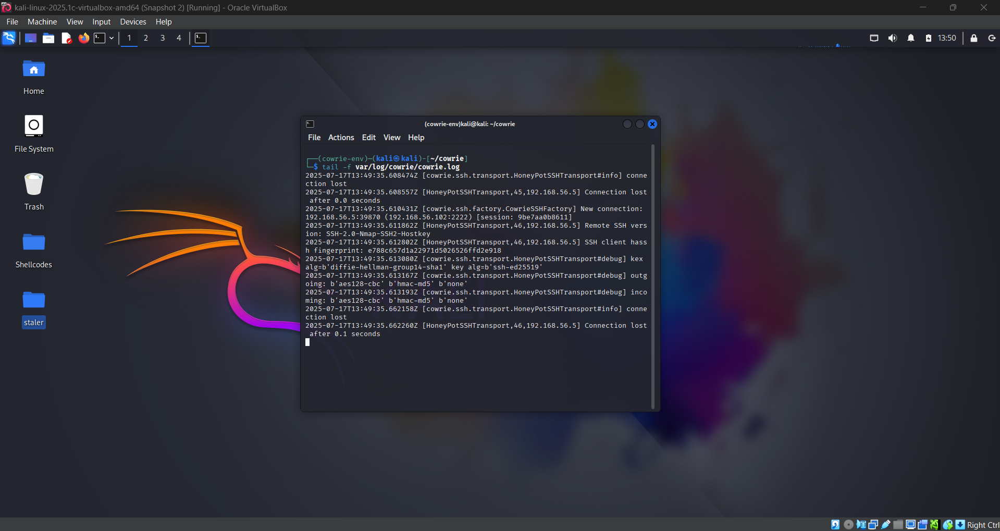

---

## 🔧 8. Challenges Faced

Throughout the deployment and simulation of the Cowrie honeypot, the following challenges were encountered:

- **⚠️ Port Binding Restrictions**:
  - Binding Cowrie to port `22` (default SSH) required root privileges, which posed security risks.
  - As a workaround, Cowrie was configured to use port `2222`.

- **🔄 SIEM Integration Complexity**:
  - Setting up HTTP Event Collector (HEC) in Splunk required token configuration, SSL handling, and log formatting.
  - Minor issues with field mapping and sourcetype categorization were resolved with manual tweaks.

- **📉 Limited Visibility (Local Testing)**:
  - Since the honeypot was deployed in a local environment, it did not attract real-world attackers.
  - All attacks were simulated manually, which limited the diversity of observed behaviors.

- **🧪 Log Formatting & Encoding**:
  - JSON logs contained long, line-by-line entries; parsing required tools like `jq`.
  - TTY playback required the correct Cowrie environment and Python script usage.

---

## 🧠 9. Key Learnings

This project provided several key insights:

- **Attacker Behavior**:
  - Even simple commands (like `ls`, `cat`, `wget`) provide valuable indicators of attacker intent.
  - Brute-force attacks typically target common usernames (`root`, `admin`) and weak passwords.

- **Honeypot Strengths**:
  - Cowrie is highly effective in simulating a real Linux environment without risking the actual system.
  - Detailed logs and fake filesystems help collect artifacts and replay sessions.

- **Honeypot Limitations**:
  - Not suitable for capturing complex payloads or post-exploitation malware behavior.
  - Limited response to non-SSH scanning (e.g., ICMP, full port scans) unless paired with network sensors.

- **Security & Logging Lessons**:
  - Effective log management requires structured storage (JSON), tools (`jq`, `Splunk`), and context.
  - Centralized log monitoring via SIEM helps correlate and alert on key attacker patterns.

---

## 🚀 10. Future Improvements

To enhance this honeypot project, the following upgrades are suggested:

- **📡 Broaden Attack Surface**:
  - Add other honeypot services like HTTP (e.g., `Honeytrap`), FTP, or Telnet to attract different threat types.

- **🌐 Real Deployment**:
  - Host the honeypot on a public-facing VPS to observe real-world threats and scan attempts.

- **🔔 Real-Time Alerting**:
  - Use tools like Splunk or Wazuh to generate email/SMS alerts for brute force or file upload activity.

- **📊 Enhanced Analytics**:
  - Integrate with the ELK (Elasticsearch, Logstash, Kibana) stack for real-time dashboards and search.

- **🤖 Automation & Feeds**:
  - Incorporate threat intelligence feeds to compare IPs, hashes, and domains with known indicators.

---

## ✅ 11. Conclusion

The Cowrie honeypot project successfully demonstrated how a simulated SSH service can be used to:

- Capture attacker behavior in a safe and controlled environment
- Log and analyze commands, session patterns, and file uploads
- Integrate with SIEM tools like Splunk for visibility and response

Even in a local environment, this project provided valuable insights into attacker methodology, system logging, and honeypot deployment strategies. Honeypots like Cowrie serve as both research tools and early warning systems for unauthorized access attempts.

> **In practice, honeypot data can be used to strengthen intrusion detection systems, validate security controls, and train incident response teams.**

---

## 📚 12. References

1. **Cowrie Honeypot GitHub Repository**  
   https://github.com/cowrie/cowrie

2. **Cowrie Documentation**  
   https://cowrie.readthedocs.io/en/latest/

3. **Hydra – Brute Force Tool**  
   https://github.com/vanhauser-thc/thc-hydra
   
4. **Introduction to Honeypots – SANS Institute**  
   https://www.sans.org/white-papers/205/

---


