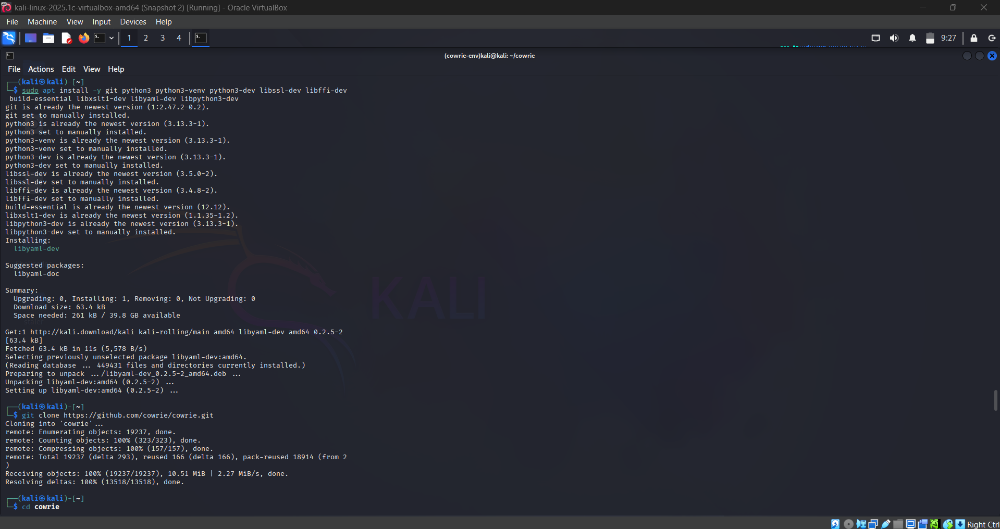
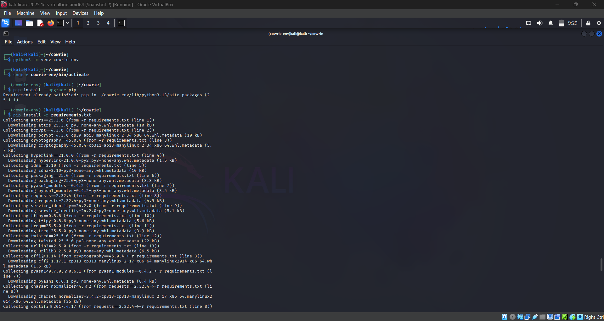
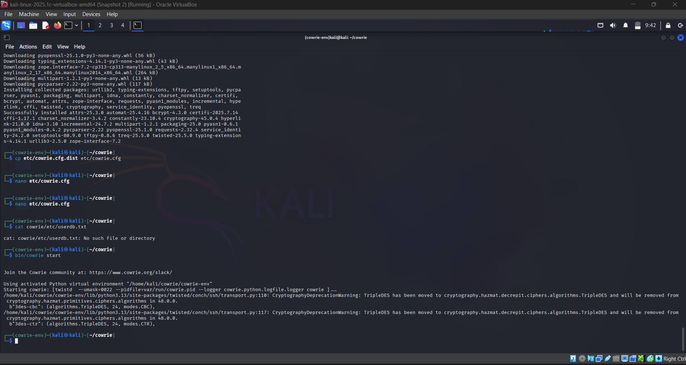
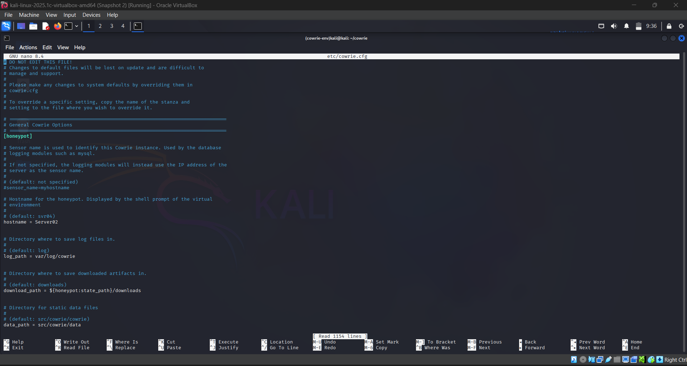
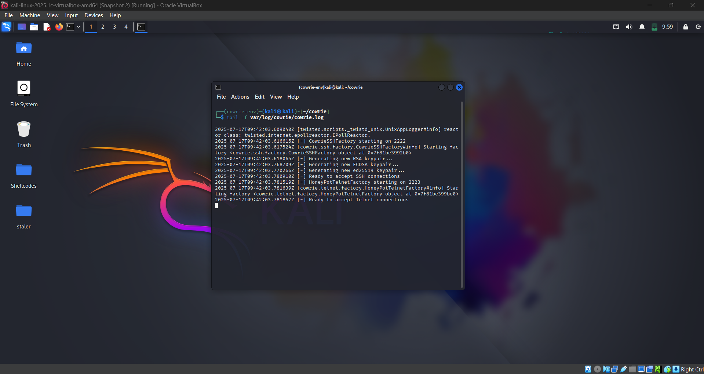

##  Installation Process

### 1. Update the System

Start by updating your package lists and upgrading existing packages:
```bash
sudo apt update && sudo apt upgrade -y
```
### 2. Install Dependencies

Install the necessary packages and libraries for Cowrie:
```bash
sudo apt install git python3 python3-pip python3-venv \ libssl-dev libffi-dev build-essential libpython3-dev authbind -y
```

### 3. Clone the Cowrie Repository

Clone the Cowrie GitHub repository to the Cowrie user's home directory:
```bash
git clone https://github.com/cowrie/cowrie.git
cd cowrie
```


### 4. Set Up Python Virtual Environment

Create and activate a Python virtual environment within the Cowrie directory:
```bash
python3 -m venv cowrie-env
source cowrie-env/bin/activate
```

### 5. Install Python Dependencies

Install the required Python packages using pip:
```bash
pip install --upgrade pip
pip install -r requirements.txt
```


## Configuration

### 1. Copy the Default Configuration Files

Copy the sample configuration files to create your own configuration:
```bash
cp etc/cowrie.cfg.dist etc/cowrie.cfg
cp etc/userdb.txt.dist etc/userdb.txt
```


### 2. Edit the Main Configuration File

Edit the config file as per your need but just for very basic use you will not require any configuration changes.
```bash
nano etc/cowrie.cfg
```
Recommended Settings:
[ssh]
enabled = true
listen_port = 22  # Change to 2222 if not using authbind

[telnet]
enabled = false

[output_jsonlog]
enabled = true

To forward logs to splunk:

[output_splunk]
enabled = true
url = https://<splunk-ip>:8088/services/collector/event
token = <your-splunk-hec-token>



### 3.Running Cowrie

Start the Honeypot
```bash
source cowrie-env/bin/activate
bin/cowrie start
```
Stop the Honeypot
```bash
bin/cowrie stop
```


Monitor Logs in Real Time
```bash
tail -f var/log/cowrie/cowrie.log
```



This concludes the installation and configuration process for cowrie for basic use, more can be done according to need.
